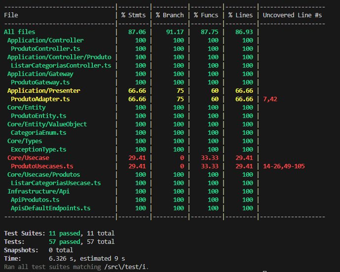
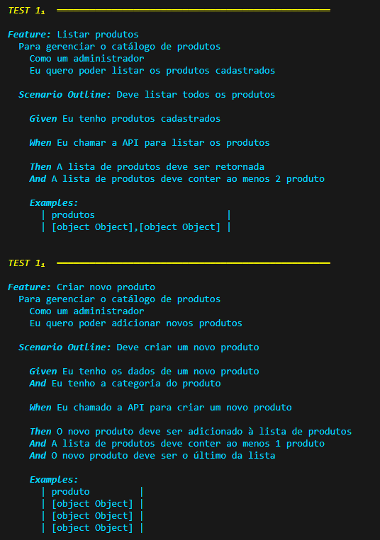

# easyOrder: Aplicação Tech Challenge POS TECH SOAT8 FIAP - Grupo 03 (Fase 4)

## Microserviço de Produtos - Requisitos da Fase 4

Este repositório contém a implementação do microserviço de produtos da aplicação easyOrder 4.0, que foi desenvolvida como parte do Tech Challenge da quarta etapa da Pós Tech de Arquitetura de Software (Turma SOAT8) da FIAP. 

## Repositório dedicado para Microserviço de Produtos 
- Inclui o código da aplicação em Typescript, conectando-se ao cluster Kubernetes previamente configurado na AWS.
- Utiliza Github Actions para CI/CD: CI para validação do código e execução de testes, e CD para deploy da imagem da aplicação no Docker Hub.
- Fornece dados (configurações em bucket S3) para a correta configuração do repositório serverless.
- Documentação detalhada sobre a aplicação e a infraestrutura.
- Instruções para execução da aplicação.

## Quality Gate

No processo de validação de CI/CD no GitHub, o Quality Gate é um conjunto de critérios que uma aplicação deve atender antes de ser implantada em produção. Ele é amplamente utilizado para garantir que apenas código de alta qualidade seja integrado ao projeto principal.

O Quality Gate é um mecanismo que impede que código de baixa qualidade seja mesclado no repositório principal. Ele pode incluir verificações automáticas, como análise de código estático, cobertura de testes, conformidade com padrões de segurança e validação de qualidade de software.

No GitHub, isso é geralmente implementado através de GitHub Actions combinadas com ferramentas de análise como SonarQube, CodeQL, ESLint, Jest, e outras.

O repositório possui um workflow de CI/CD configurado com o Github Actions, que realiza a validação e deploy da application na AWS.

## Quality Gate - SonarCloud

O repositório possui a integração com SonarCloud, que avalia qualidade de código e indica a cobertura geral de testes da aplicação.

O Projeto no SonarCloud pode ser acessado em:
 https://sonarcloud.io/project/overview?id=pos-tech-soat08-03_easyOrder-challenge4-app-produto

[](https://sonarcloud.io/summary/new_code?id=pos-tech-soat08-03_easyOrder-challenge4-app-produto)
[](https://sonarcloud.io/summary/new_code?id=pos-tech-soat08-03_easyOrder-challenge4-app-produto)

## Cobertura de Testes

</mark>

## Roteiro de Testes BDD



## Banco de Dados Não Relacional - MongoDB

<mark>-------------- Inserir info sobre MongoDB ---------------</mark>

## Configuração do CI/CD

O repositório possui um workflow de CI/CD configurado com o Github Actions, que realiza a validação e deploy do Microserviço na AWS.

### CI - Continuous Integration

O workflow de CI é acionado a cada push no repositório.

[As ultimas execuções do CI podem ser visualizadas nesse link](https://github.com/pos-tech-soat08-03/easyOrder-challenge4-app-produto/actions/workflows/application-ci.yml)


### CD - Continuous Deployment

O workflow de CD possui duas etapas:

- A primeira acontece ao finalizar o merge, e realiza o deploy da aplicação no Docker Hub.
[As ultimas execuções do CD de Imagem podem ser visualizadas nesse link](https://github.com/pos-tech-soat08-03/easyOrder-challenge4-app-produto/actions/workflows/application-cd-img.yml)


- A segunda parte é manual, e realiza o deploy da aplicação no Cluster EKS na AWS.
[As ultimas execuções do CD EKS podem ser visualizadas nesse link](https://github.com/pos-tech-soat08-03/easyOrder-challenge4-app-produto/actions/workflows/application-cd-eks.yml)


### Subindo a aplicação na AWS com o Github Actions (Produção)

Para subir os recursos Serverless com o Github Actions, siga os passos abaixo:

1. Acesse o repositório do Github e clique na aba `Actions`, ou acesse diretamente o link abaixo:
https://github.com/pos-tech-soat08-03/easyOrder-challenge4-app-produto/actions

2. Clique no workflow `Application CD - Deploy no EKS` e em seguida clique no botão `Run workflow`

O workflow irá solicitar as chaves de acesso da AWS, que serão obtidas do ambiente do AWS Labs, e também o nome do bucket anteriormente criado no S3, que  armazena o estado do Terraform da Infraestrutura necessária para a subida dos Serviços:

```plaintext
environment: <Ambiente de deployment (ex.: lab, staging, prod)>
aws_access_key_id: <AWS Access Key ID>
aws_secret_access_key: <AWS Secret Access Key>
aws_session_token: <AWS Session Token>
aws_account_id: <AWS Account ID>
aws_backend_bucket: <AWS S3 Bucket para armazenamento do estado do Terraform>
aws_region: <AWS Region>
```

Ao final da execução do workflow a aplicação terá os manifestos aplicados via kubectl no ambiente do cluster EKS na AWS. Os dados de ALB e outras configuracões serão armazenadas no bucket S3 (mesmo utilizado na Infraestrutura).

A aplicação também estará disponível no endereço do ALB, que será informado ao final da execução do workflow - porém o acesso à aplicação será restrito por segurança via API Gateway. 
- Acesse o repositório de [Serverless](https://github.com/pos-tech-soat08-03/easyOrder-challenge4-serverless) para mais informações sobre a configuração do API Gateway 

### Para gerenciar a aplicação no Cluster EKS a partir de um ambiente local

O ambiente local deve estar configurado com o AWS CLI e o kubectl, e com as credenciais de acesso ao cluster EKS configuradas.

Para configurar o acesso ao cluster EKS, siga os passos abaixo:

``` bash
minikube start
aws eks update-kubeconfig --name easyorder --region us-east-1
kubectl config get-contexts
```

Identifique o contexto do Cluster EKS e utilize o comando abaixo para configurar o acesso remoto:

``` bash
kubectl config use-context <context-name>
kubectl config current-context
```

A partir deste ponto você poderá gerenciar o Cluster EKS a partir do seu ambiente local. Ações comuns incluem:

``` bash
kubectl get nodes
kubectl -- get pods -A
kubectl logs easyorder-deployment-xxxxxxxxx
kubectl get svc svc-easyorder
```

### Subindo a aplicação manualmente (Desenvolvimento) - Docker

Para iniciar o _build_ da aplicação já atendendo aos pré-requisitos e rodar no servidor, podem ser executados os seguintes comandos:

- Buildar a aplicação de acordo com o arquivo docker-compose.yml
    
    Windows:
    ``` bash
    docker compose up --build
    ```

    Linux:
    ``` bash
    sudo docker-compose up --build
    ```

### Subindo a aplicação manualmente (Desenvolvimento) - Kubernetes

No diretório easyOrder/manifesto_kubernetes

``` bash
kubectl apply -f svc-easyorder-database.yaml
kubectl apply -f pvc-easyorder-database.yaml
kubectl apply -f easyorder-database-configmap.yaml
kubectl apply -f easyorder-database-deployment.yaml
kubectl apply -f svc-easyorder.yaml
kubectl apply -f easyorder-configmap.yaml
kubectl apply -f easyorder-deployment.yaml
kubectl apply -f easyorder-hpa.yaml
```
Desta forma inciará: 
- service/svc-easyorder-database
- configmap/easyorder-database-configmap
- persistentvolumeclaim/pvc-easyorder-database
- deployment.apps/easyorder-database-deployment
- service/svc-easyorder
- configmap/easyorder-configmap
- deployment.apps/easyorder-deployment
- horizontalpodautoscaler.autoscaling/easyorder-hp

### Verificar se está funcionando

Neste ponto, o serviço deve estar ativo, para verificar se está funcionando, basta acessar a url [http://localhost:3000/](http://localhost:3000/). 

_Caso esteja acessando a aplicação de outro host, favor modificar a URL para o endereço correto do seu host._  

### Acesso à Documentação do Swagger

Para acessar a documentação do Swagger, acessar a url [http://localhost:3000/doc/](http://localhost:3000/doc/) - você poderá navegar e testar todos os endpoints, com exemplos disponíveis.

_Caso esteja acessando a aplicação de outro host, favor modificar a URL para o endereço correto do seu host._  


## Sobre a aplicação / Arquitetura

A aplicação foi implementada utilizando a linguagem Typescript, seus pré-requisitos padrão (Node, Ts-Node, etc) e inclui a utilização de alguns pacotes como apoio:
- Express como framework minimalista de Web Application
- Swagger-autogen e Swagger-ui-express para documentação e acesso ao swagger dos endpoints / APIs
- Mysql2 e Sequelize para implementação de persistência em Banco de Dados (MySQL na implantação de Produtos)
- Jest e Axios para Testes unitários e de integração
- Testes BDD 

## Arquitetura da Aplicação

A arquitetura utilizada no sistema foi a **Arquitetura Limpa / Clean Architecture**. A aplicação foi completamente refatorada para garantir que alguns princípios importantes sempre fossem respeitados:
- Regra de dependência: em que as dependências sempre apontam para dentro, ou seja, que camadas mais internas não dependam e não tenham conhecimento sobre recursos / objeto / tecnologias das camadas externas.
- Encapsulamento das entidades: regras das entidades do core não podem ser afetadas pelo seu relacionamento com outras parte da aplicação (não podem ser alteradas por necessidades de alteração em outras camadas)
- Regras de negócio isoladas: utilizando casos de uso, as regras de negócio permanecem em uma camada intermediária entre entidades e adaptadores do mundo externo. Casos de uso somente são alteradas por necessidades reais do negócio.
- Adaptadores de interfaces: converte informações de-para camadas internas e externas (gateways e presenters), e orquestram chamadas através de controllers 
- Frameworks somente podem ser utilizados na camada mais externa de infraestrutura (frameworks e drivers, nesse diagrama)

## Estrutura dos Diretórios

    .
    ├── docs                   # Documentos adicionais
    ├── src                    # Código Fonte
    │   ├── easyorder          # Código da aplicação
            ├── Infrastructure
            ├── Application
            ├── Core
        ├── tests              # testes unitários e de integração
        ├── app.ts             # ponto de entrada da aplicação
    ├── manifesto_kubernetes   # manifestos kubernetes (yml)                              
    ├── Dockerfile             # configuracões docker                 
    ├── docker-compose.yml     # configurações docker-compose
    ├── package.json           # dependências Node/TS
    ├── tsconfig.json          # arquivo de configuração TS
    └── README.md              # este arquivo

Existem outros arquivos de apoio que não estão listados aqui, mas que são importantes para o funcionamento da aplicação.
- Configurações e variáveis de ambiente
- Arquivos de configuração do SonarQube
- Arquivos de configuração do Github Actions
- Arquivos de configuração do Swagger
- Arquivos de configuração do Jest

## Detalhamento da estrutura do Código Fonte

#### /src/easyorder/Infrastructure/*
- Este diretório contém as implementações técnicas responsáveis por interagir com o ambiente externo. Ele lida com APIs externas, bancos de dados e outros serviços, implementando as interfaces de entrada e saída da aplicação.

#### /src/easyorder/Infrastructure/Api/*
- Implementa os endpoints expostos ao mundo externo, recebendo e processando chamadas HTTP. Esses adaptadores traduzem as solicitações recebidas e acionam os Controllers para direcionamento aos casos de uso adequados

#### /src/easyorder/Infrastructure/DB/*
- Implementa os adaptadores de persistência de dados (banco de dados) da aplicação. Implementa, entre outras, as funções de inserir, buscar e remover dados do banco implementado.

#### /src/easyorder/Infrastructure/Service/*
- Implenta a comunicação com serviços externos de mensageria e, neste caso, com o Serviço de Pagamentos

#### /src/easyorder/Application/*
- Contém a lógica de aplicação, onde são definidos os controladores, gateways e presenters. Esta camada orquestra (no caso dos controllers) e traduz/adapta (no caso dos gateways e presenters) o fluxo de dados entre a camada externa (infraestrutura) e o núcleo da aplicação (core).

#### /src/easyorder/Application/Controller/*
- Contém os controllers que lidam com as requisições de entrada dos endpoints (externos) ou de outros sistemas. São responsáveis por rotear as requisições e invocar os casos de uso corretos.

#### /src/easyorder/Application/Gateway/*
- Implementa as interfaces de Gateways, que lidam com a comunicação com serviços externos, seguindo as portas definidas no Core. 

#### /src/easyorder/Application/Presenter/*
- Responsável por formatar e apresentar os dados de resposta à camada de infraestrutura. Realiza a adaptação dos dados retornados pelos casos de uso para o formato adequado à interface de saída.

#### /src/easyorder/Core/*
- O núcleo da aplicação, onde reside a lógica de negócios. Esta camada é completamente independente das camadas externas e define as entidades, interfaces, tipos e casos de uso.

#### /src/easyorder/Core/Entity/*
- Contém as entidades de domínio, que representam os objetos principais da lógica de negócios, com suas regras e propriedades.
  - Também são utilizadas estruturas de ValueObject na respectiva pasta. Estas estruturas refletem o seu equivalente nos conceitos de DDD.

#### /src/easyorder/Core/Interfaces/*
Define as interfaces (portas) que descrevem como os adaptadores externos devem interagir com o Core, garantindo a separação entre a lógica de negócios e a infraestrutura.

#### /src/easyorder/Core/Types/*
Contém tipos e definições compartilhadas, que auxiliam no transporte de dados entre as diferentes camadas da aplicação.

#### /src/easyorder/Core/Usecase/*
Contém os casos de uso, responsáveis por executar as regras de negócios da aplicação. 
- As classes nos casos de uso devem ter nomes que representem ações, sempre em forma de verbos.
- O nome da classe reflete a ação a ser realizada.

## Padrões que utilizamos no nosso Desenvolvimento

### Nomenclaturas:

- No final do nome do arquivo, sempre coloque o que é o arquivo (Service, Usecase, Interface, Endpoints, etc.)
- Variáveis devem começar com minúsculo em camelCase
- Arquivos e classes devem começar com maiúsculo em camelCase
- Constantes e variáveis de ambiente devem ser escritas em MAIÚSCULO

### Uso do git:

- Branches estão sempre protegidas; somente é possível fazer merge com Pull Request

- Sempre em português
- Todo commit deve ser bem descritivo do que foi feito
- Fazer o menor tamanho de commit possívels
- Sempre em Branches (ramos) e depois fazer o merge
- No mínimo 1 aprovador de Pull Request
- Utilizar os seguintes prefixos, quando possível com o número da atividade no projeto:

    - `Hotfix: {NúmeroTask} - {mensagem}` Para bugs
    - `Feature: {NúmeroTask} - {mensagem}` Para implementar funcionalidades
    - `Chore: {NúmeroTask} - {mensagem}` Para alterações que não impactem o uso (débito técnico)

## Documentação adicional

Para mais informações sobre a arquitetura, verifique o readme dos outros repositorios:

Infraestrutura: https://github.com/pos-tech-soat08-03/easyOrder-challenge4-infrastructure

Serverless: https://github.com/pos-tech-soat08-03/easyOrder-challenge4-serverless 

Microserviços (aplicações):
- Produto https://github.com/pos-tech-soat08-03/easyOrder-challenge4-app-produto
- Cliente https://github.com/pos-tech-soat08-03/easyOrder-challenge4-app-cliente
- Core (Pedido, Pagamento e Preparação) https://github.com/pos-tech-soat08-03/easyOrder-challenge4-app-core