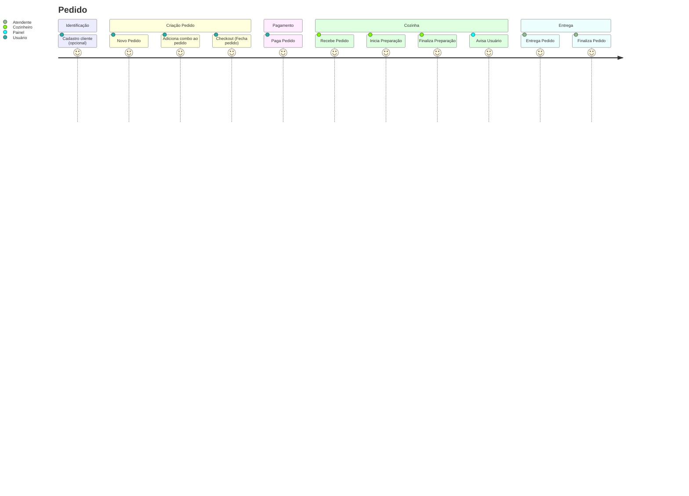

## Guia Simplificado de Sequência de Execução das APIs

<mark>Importante:</mark> Caso tenha acessado diretamente este arquivo, recomendamos realizar a execução completa seguindo as instruções descritas em [### 🔩 Rodando Testes Ponta a Ponta (_End-to-end - E2E_) e Entendendo o Fluxo de Execução](../README.md#-rodando-testes-ponta-a-ponta-end-to-end---e2e-e-entendendo-o-fluxo-de-execução)

A chamada para teste fim-a-fim é realizada através de:

``` bash
docker exec -it easyorder npx jest ./app.e2e.test.ts --verbose true
```

Também, a própria aplicação expõe um Endpoind com uma documentação Swagger navegável ([http://localhost:3000/doc](http://localhost:3000/doc)) onde as chamadas podem ser realizadas diretamente com exemplos prontos.

- A documentação Swagger é baseada no arquivo [swagger-output.json](../src/swagger-output.json) que, caso prefira, pode ser importado em qualquer aplicação que gerencia Collections em formato OpenAPI 2.0 (ex. Postman)

Se você permaneceu aqui e deseja seguir com o passo a passo, siga a sequência sugerida:

### (1) Crie Produtos

[(/produto/cadastrar)](http://localhost:3000/doc/#/Produtos/post_produto_cadastrar) Cadastre Lanches, Sobremesas, Bebidas e Acompanhamentos
- Anote os **ids de Produtos** obtidos para utilizar nas etapas subsequentes de criação de **Combos**

### (2) Opcional - Crie um Cliente

[(/cliente/cadastrar)](http://localhost:3000/doc/#/Clientes/post_cliente_cadastrar) Cadastre um novo Cliente
- Anote o **id de Cliente** obtido para utilizar na etapa de criação de Pedidos, caso queira o Cliente identificado

### (3) Crie um Pedido

[(/pedido)](http://localhost:3000/doc/#/Pedidos/post_pedido) Cria a etapa inicial do Pedido
- Anote o **id de Pedido** obtido, nessa etapa ele ainda é um 'rascunho'
- A identificação de um Cliente é opcional
- O Pedido pode ser cancelado a qualquer momento

### (4) Adicione Combo(s) ao Pedido

[(/combo/adicionar)](http://localhost:3000/doc/#/Pedidos/post_pedido__pedidoId_combo) Adiciona combo ao Pedido
- Essa etapa pode ser repetida, pois um Pedido aceita mais de um combo
- Quando adicionar um produto ao combo, devemos verificar se o tipo do produto informado corresponde ao tipo de produto solicitando a inserção no combo
- O combo deve ter ao menos um produto informado
- Só podemos adicionar ou remover combos ao pedido se este estiver no status EM_ABERTO

### (5) Realize o Checkout do Pedido

[(/pedido/{pedidoId}/checkout)](http://localhost:3000/doc/#/Pedidos/put_pedido__pedidoId__checkout) Checkout: Fecha pedido e encaminha para Serviço de Pagamento
- Para fechar um pedido, deverá existir ao menos um combo vinculado
- O checkout gera uma Transação, que fica aguardando pagamento

### (6) Execute as etapas de Pagamento

[(/pagamento/listar-transacoes/{pedidoid})](http://localhost:3000/doc/#/Pagamentos/get_pagamento_listar_transacoes__pedidoId_) Busca transação criada e enviada para Serviço de Pagamento
- Obtenha e anote o **id da Transação** pendente de pagamento
- _Esta etapa somente existe no MVP, pois o serviço de pagamento não está integrado ao caixa_

[(/pagamento/webhook)](http://localhost:3000/doc/#/Pagamentos/put_pagamento_webhook_) Recebe confirmação de transação e encaminha pedido para Fila de Preparação
- Os status previstos para respostas de Transação no MVP são "approved" ou "denied"
- A baixa de pagamento através da aprovação da Transação atualiza automaticamente o Pedido e seu status, liberando o mesmo para a Fila de Preparação

### (7) Inicie a Preparação do Pedido

[(/preparacao/pedido/proximo)](http://localhost:3000/doc/#/Prepara%C3%A7%C3%A3o/get_preparacao_pedido_proximo) Busca próximo Pedido na fila de preparação
- Anote o **id de Pedido**, já disponível para preparação pela cozinha

[(/preparacao/pedido/{pedidoId}/iniciar-preparacao)](http://localhost:3000/doc/#/Prepara%C3%A7%C3%A3o/put_preparacao_pedido__pedidoId__iniciar_preparacao) Inicia preparação do pedido
- Avance a etapa utilizando o **id de Pedido**

### (8) Finalize a Preparação do Pedido

[(/preparacao/pedido/{pedidoId}/finalizar-preparacao)](http://localhost:3000/doc/#/Prepara%C3%A7%C3%A3o/put_preparacao_pedido__pedidoId__finalizar_preparacao) Finaliza preparação do Pedido
- Avance a etapa utilizando o **id de Pedido**

### (9) Etapa Final - Entregue e Finalize o Pedido

[(/preparacao/pedido/{pedidoId}/entregar)](http://localhost:3000/doc/#/Prepara%C3%A7%C3%A3o/put_preparacao_pedido__pedidoId__entregar) Entrega e Finaliza Pedido
- Avance a etapa utilizando o **id de Pedido**


## Jornada do Cliente - Macro

A jornada simplificada fica (na ótica do Cliente):


